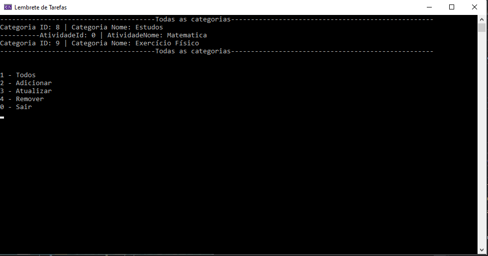
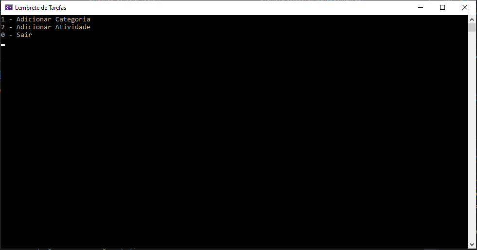
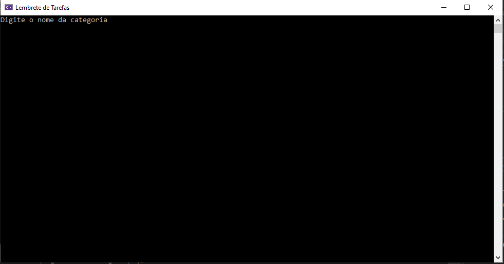
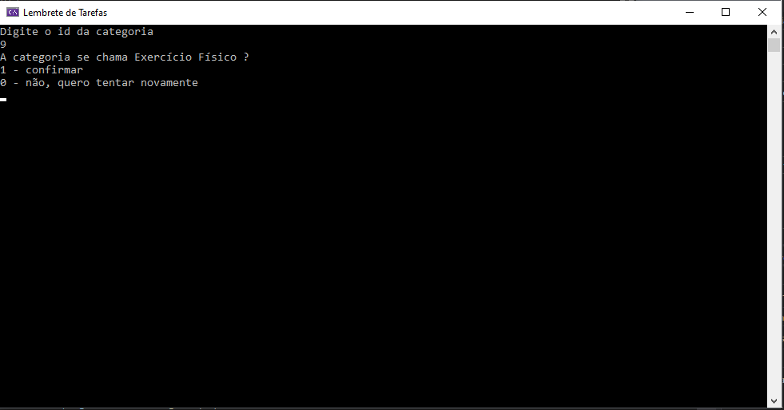
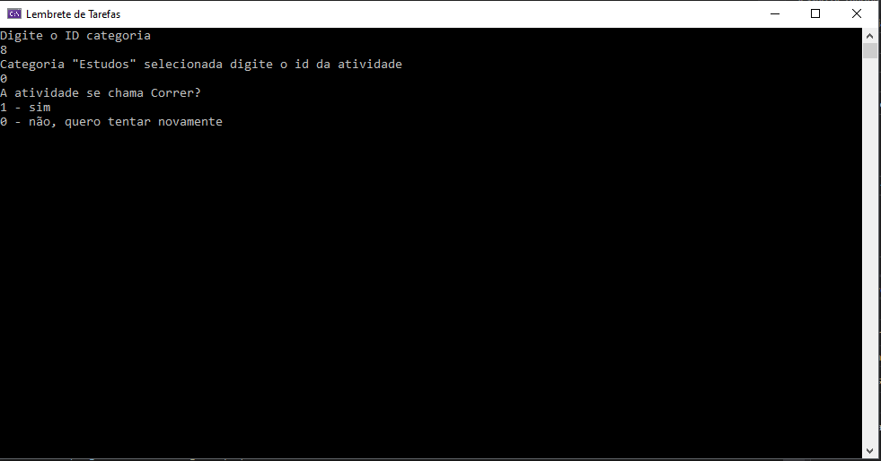
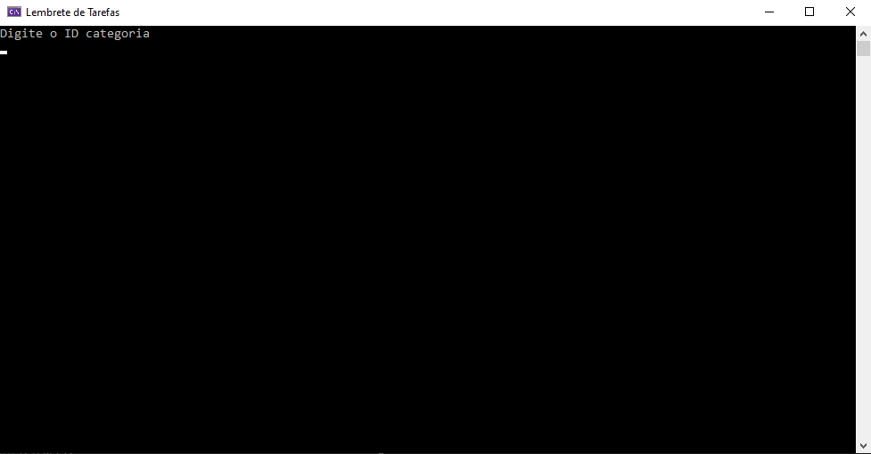

# Agenda_Console
linq, EF, SQLite campos de entrada sem validação e sem controle de erros, estudos práticos com Linq e EF
 

Imgens das telas

Listando todos

Menu adicionar

Menu adicionar categoria

Menu atividade adicionar atividade

Menu atualizar

Menu atualizar categoria

Menu atualizar atividade

Menu remover

Menu remover categoria

